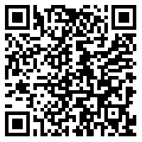
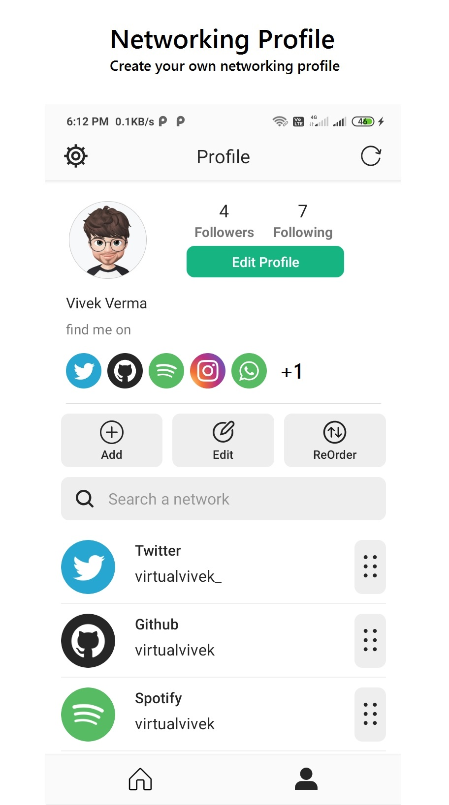
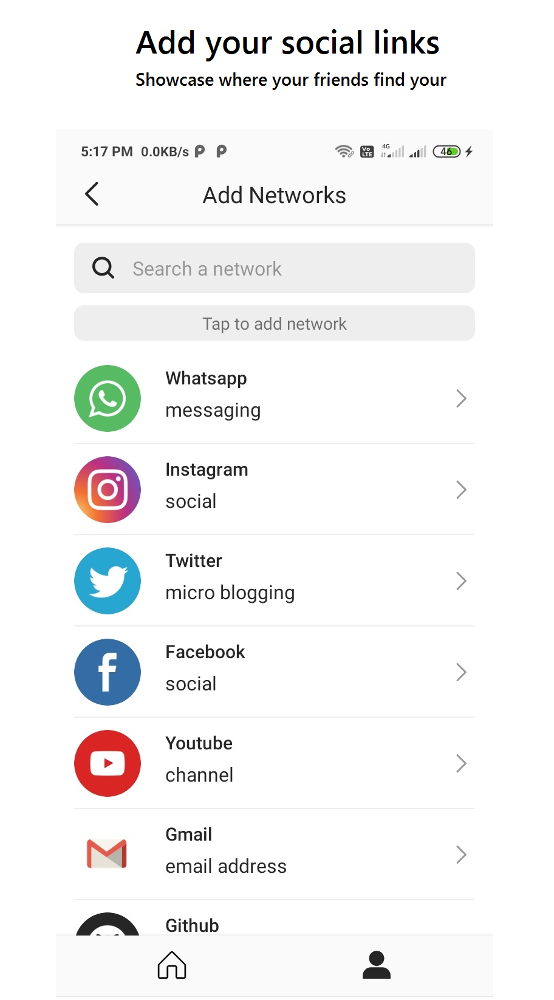
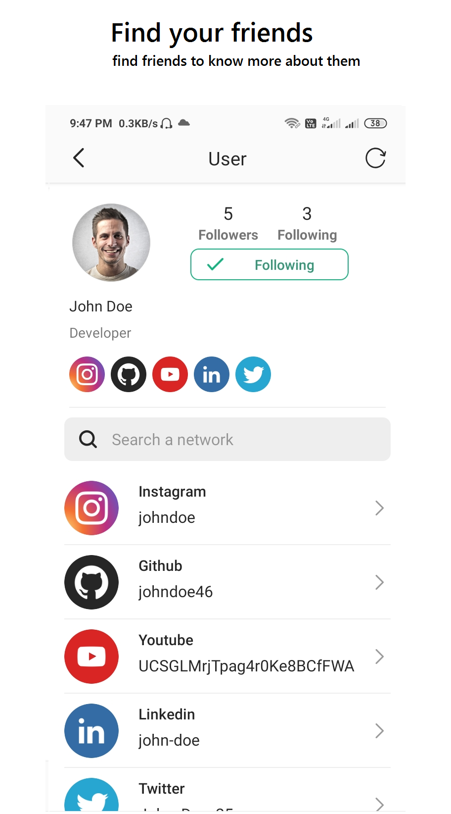
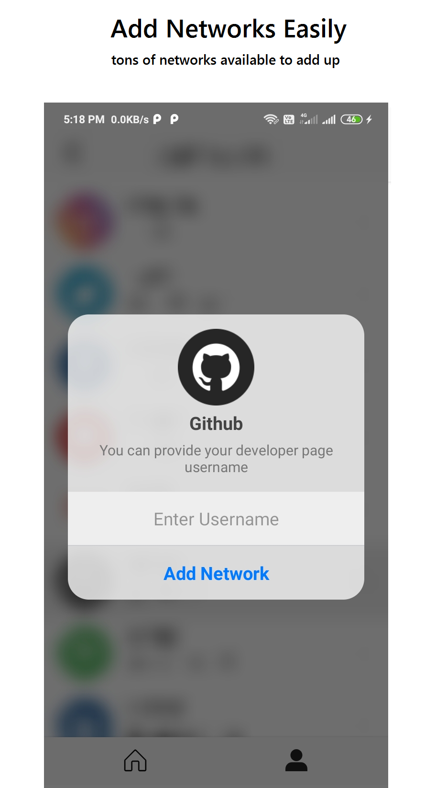

 
 
<h1>ReachMe Social  <i>ReachMe Inc.</i>  </h1>

<a href="apk/reachme_social.apk?raw=true"><a> 

   
    

<h2 align="left">

</h2>

 
<h2>About this app</h2>
<h3>ReachMe social helps you to showcase your digital existence and share it with your friends. </h3>

Follow other networking profiles and easily connect with every aspect of their links available for you. 

